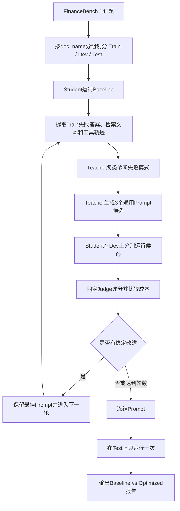

# FinanceBench Agentic RAG Prompt 自学习：初步方案

## 1. 目标

在 FinanceBench 141 题上建立一个完整、可重复、无测试集泄漏的 Agentic RAG Prompt 自学习流程：

- Student：能力较弱的目标模型，负责实际使用 DeepRead 工具检索并回答问题。
- Teacher：更强的模型，根据 Student 在训练集上的失败，生成或修改通用 Agent 指令。
- Judge：固定不变的评测模型，负责按照现有 0–4 分标准评分。
- Optimizer：外层脚本，负责组织数据划分、运行、反馈整理、Prompt 候选生成、候选比较和版本保存。

这里的“学习”是 Prompt 层面的学习，不更新 Student 模型权重。

## 2. 核心研究问题

1. 高阶模型能否从低阶模型的失败轨迹中总结出具有共性的 Agent 行为规则？
2. 这些规则能否在未参与 Prompt 生成的问题上提高 Accuracy 和 Evidence Recall？
3. 提升是否伴随不可接受的 Token、延迟或工具调用增长？
4. 改进发生在哪个阶段：文档定位、证据检索、信息综合、数值计算还是答案核验？

## 3. 推荐的第一版路线

第一版采用自定义的 OPRO-style Prompt 优化循环，而不是直接引入 DSPy、TextGrad 等新框架。

原因：

- 现有 DeepRead 已经支持 `store.agent_instructions` 注入额外提示词。
- 现有 harness 已经保存答案、召回文本、Token 和评分。
- 自定义外层循环改动小，容易审计每一轮 Teacher 到底修改了什么。
- 141 题规模较小，先验证方法比引入大型优化框架更重要。

第一版只优化一份**全局通用 Agent 指令**，不生成每道题专属 Prompt，也不根据公司或答案生成规则。

## 4. 整体流程



## 5. 为什么必须划分训练、开发和测试集

Teacher 会看到 Student 的错误答案、Gold Answer 和 Gold Evidence。如果同一道题随后又用于证明 Prompt 有效，就发生了数据泄漏。

建议按文档分组划分：

- Train：约 85 题，用于 Teacher 学习失败规律。
- Dev：约 28 题，用于比较 Prompt 候选和提前停止。
- Test：约 28 题，Prompt 冻结后只运行一次。

划分时以 `doc_name` 为组，同一份财报中的问题必须进入同一个 split。这样 Teacher 不会在训练集中看到某份财报的答案，又在测试集中遇到同一份财报的相似问题。

在文档分组约束下，题数可能不能精确等于 85/28/28，应以接近 60%/20%/20% 且问题类型分布平衡为目标。

稳定配对键使用 `financebench_id`，不能只依赖运行时重新生成的 `_global_index`。

## 6. 两阶段执行策略

### 6.1 20 题 Pilot

先从 Train 中选 20 题，仅用于打通闭环：

- 覆盖 `domain-relevant`、`metrics-generated`、`novel-generated`；
- 覆盖信息抽取、数值计算和逻辑推理；
- 不从已知 Gold 冲突案例中集中抽样；
- Student Baseline 跑一次；
- Teacher 生成 2～3 个候选；
- Student 重新跑候选；
- 验证日志、评分、Prompt 注入和结果配对都正确。

Pilot 的结果只回答“整个流程能否工作”，不对总体效果下结论。

### 6.2 141 题正式流程

Pilot 通过后：

1. 固定 Train/Dev/Test manifest。
2. Student 在 141 题上运行 Baseline，获得三份初始结果。
3. Optimizer 只把 Train 失败交给 Teacher。
4. Teacher 每轮生成 3 个候选 Prompt。
5. 3 个候选只在 Dev 上运行和比较。
6. 最多进行 2 轮；连续两轮没有 Accuracy 改进则停止。
7. 冻结最佳 Prompt，在 Test 上只运行一次。
8. 可选：最终再在全 141 题上运行一次，作为部署描述性结果；该结果不能称为完全 held-out 结果。

## 7. Student Baseline

如果老师提供的 Student 模型与历史模型不同，必须重新跑 Baseline，不能把以前的结果当作正式基线。

Baseline 要固定：

- Student 模型和 Endpoint；
- Temperature = 0；
- 文档索引；
- BM25/Vector/Hybrid 开关；
- `top_k`、分页和最大轮数；
- 并发数；
- Judge 模型和评测 Prompt。

推荐第一版基于现有 `financebench_stateful.yaml` 的检索策略：

- `enable_session_pagination: true`
- `retrieval_topk: 1`
- `agent_topk_max: 10`
- `preload_directory_structure: false`
- `enable_vector: true`
- `enable_hybrid: false`
- `enable_semantic: false`

第一版只改变 `store.agent_instructions`，避免 Prompt 优化与检索配置优化混在一起。

## 8. 失败记录如何交给 Teacher

不能把全部原始日志一次性塞给 Teacher。Optimizer 应将每道 Train 失败压缩为结构化记录：

```json
{
  "financebench_id": "...",
  "question_type": "metrics-generated",
  "question_reasoning": "Numerical reasoning",
  "question": "...",
  "student_answer": "...",
  "gold_answer": "...",
  "judge_score": 1,
  "judge_reason": "...",
  "evidence_recall": 1.0,
  "retrieved_evidence": ["..."],
  "tool_trace": [
    "bm25_search(scope=full,...)",
    "get_doc_structure(doc_id=...)",
    "read_section(doc_id=...,node_id=...)"
  ],
  "failure_stage": "evidence_hit_but_answer_wrong"
}
```

每轮最多给 Teacher 36 个案例，分成 3 批，每批 12 个。案例按题型和失败阶段平衡抽样，避免 Teacher 只为某一种题生成过度专门化的规则。

## 9. 失败阶段自动分类

Optimizer 应优先使用可自动计算的阶段，而不是人工逐题分类：

1. `correct_document_not_reached`
2. `correct_document_seen_not_read`
3. `correct_document_read_evidence_not_recalled`
4. `evidence_recalled_answer_wrong`
5. `answer_partially_correct`
6. `success`

人工只抽查每类 3～5 个样本，用于确认自动分类没有明显偏差，不需要人工审查全部 141 题。

## 10. Teacher 要生成什么

Teacher 不直接修改代码，也不为某一道题写答案。它要输出 3 个短小、通用、可审计的 Agent Prompt 候选。

允许生成的规则示例：

- 在回答包含多个对象的问题前，列出必须覆盖的对象并逐项核验。
- 数值题在作答前核对期间、单位、分子和分母。
- 全库检索找到候选文档后，优先切换为文档内检索。
- 多次 BM25 返回相同文本时，改变关键词、提高 `top_k` 或使用另一种检索方法。
- 最终回答前检查结论是否与检索到的原文方向一致。

禁止生成：

- 公司专属规则；
- 某道题的答案或数字；
- 特定 `doc_id`；
- 从 Train Gold 复制出来的事实；
- 绕过工具或改变检索配置的指令；
- 超过 800 tokens 的长 Prompt。

## 11. Prompt 候选如何注入

现有 DeepRead 已支持：

```yaml
store:
  agent_instructions:
    - "Before answering a multi-part question, enumerate every requested item and verify that each is supported by retrieved text."
    - "For numerical questions, verify reporting period, units, numerator and denominator before calculating."
```

Optimizer 为每个候选生成一份派生 YAML，其他字段全部保持相同，只替换 `agent_instructions` 和输出目录。

每份派生配置和 Prompt 都必须保存哈希，保证结果可以追溯到准确版本。

## 12. 候选选择规则

主要指标：

- Dev Average Accuracy Normalization。

辅助指标：

- Evidence Recall；
- 相对 Baseline 的逐题提升数减下降数；
- 平均输入 Token；
- 平均延迟；
- 平均 Agent 轮数。

选择采用优先级而不是任意加权：

1. Accuracy 不能下降。
2. Dev 平均 Accuracy 更高者优先。
3. Accuracy 接近时，逐题净提升更多者优先。
4. 仍相同时，Evidence Recall 更高者优先。
5. 最后选择 Token 和延迟更低者。

回归保护：如果某候选使 2 道以上 Dev 题下降至少 2 个原始评分点，则拒绝该候选，即使平均分略有提高。

## 13. 第二轮学习

第二轮 Teacher 输入包括：

- 第一轮最佳 Prompt；
- 相对 Baseline 的提升案例摘要；
- 相对 Baseline 的退化案例摘要；
- 工具调用和 Token 的变化；
- 第一轮 Prompt 的已知风险。

Teacher 只能对通用规则做增删改，仍然不能看到 Test 数据。

初始建议最多 2 轮。141 题较少，轮数过多容易对 Dev 过拟合。

## 14. 最终报告应回答什么

正式报告至少包括：

1. Baseline 与最终 Prompt 的完整文本。
2. Train/Dev/Test 的固定划分和分布。
3. Test 上的 Accuracy、Recall、F1、Token、延迟和轮数。
4. Test 逐题 paired changes：提升、下降、不变。
5. 各失败阶段数量如何变化。
6. 哪些通用规则实际带来收益。
7. Prompt 优化是否造成成本上升或新的退化类型。
8. 典型成功和失败案例各 2～3 个，并展示真实检索文本。

## 15. 预计耗时

根据现有历史日志，复用索引、3 workers 时：

- 20 题 Student 运行：约 15～30 分钟/候选，含评测后预留 20～40 分钟。
- 28 题 Dev：约 20～35 分钟/候选。
- 141 题 Baseline：约 1.5～2 小时，不含重新建库。
- Teacher 生成候选：通常远短于 Student 完整 RAG 运行。

两轮、每轮 3 个候选的正式流程，若不重建索引，预计约 4～7 小时；具体取决于 Student 模型延迟、API 限流和评测耗时。

第一版不要每轮重跑 Train 85 题；Train 主要提供失败反馈，候选统一在 Dev 上比较。这样可以控制成本。

## 16. 主要风险与控制

### 数据泄漏

控制：按 `doc_name` 分组划分；Teacher 只看 Train；Test 只在 Prompt 冻结后运行。

### Prompt 记忆具体答案

控制：Teacher 输出禁止出现公司名、金额、年份、`doc_id` 和题目专属事实；自动检查后再注入。

### 对 Judge 过拟合

控制：Judge 模型和评测 Prompt 全程固定；保留 F1、Recall 和人工抽查作为辅助。

### 成本失控

控制：先 20 题 Pilot；每轮最多 3 个候选；最多 2 轮；Prompt 不超过 800 tokens；复用索引。

### 多变量混淆

控制：第一版只改变 `agent_instructions`，不同时修改 `top_k`、目录预加载、检索工具或模型。

### 平均分掩盖退化

控制：同时记录逐题 paired changes，并设置严重退化数量上限。

## 17. 审核通过后的实现文件

计划新增以下脚本：

```text
scripts/prepare_splits.py
scripts/run_student.py
scripts/build_teacher_feedback.py
scripts/generate_prompt_candidates.py
scripts/render_candidate_configs.py
scripts/evaluate_candidates.py
scripts/select_candidate.py
scripts/run_self_learning_loop.py
scripts/make_final_report.py
```

每个脚本只承担单一职责，并提供 `--dry-run`。正式运行入口最终为：

```powershell
python scripts/run_self_learning_loop.py `
  --experiment config/experiment.yaml `
  --mode pilot
```

Pilot 审核通过后再运行：

```powershell
python scripts/run_self_learning_loop.py `
  --experiment config/experiment.yaml `
  --mode full
```

以上命令目前是实施目标，本轮尚未创建或执行这些脚本。
